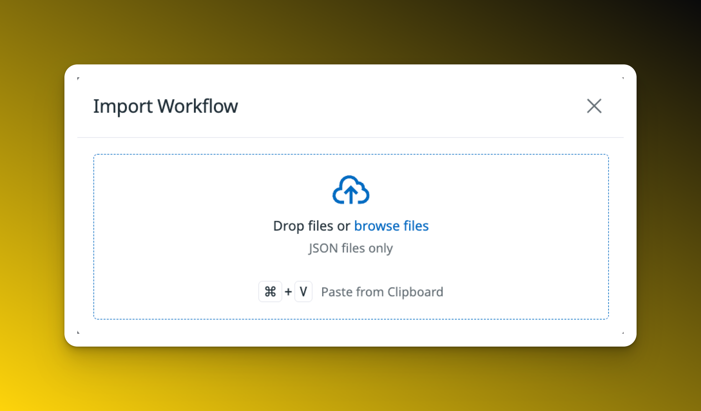
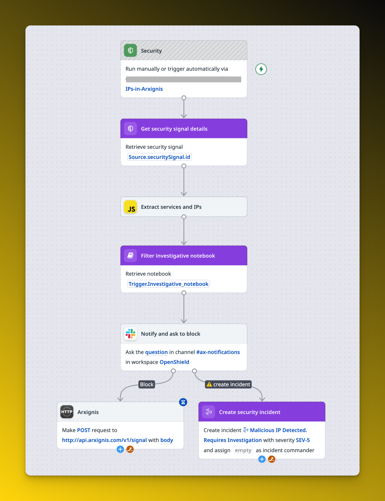
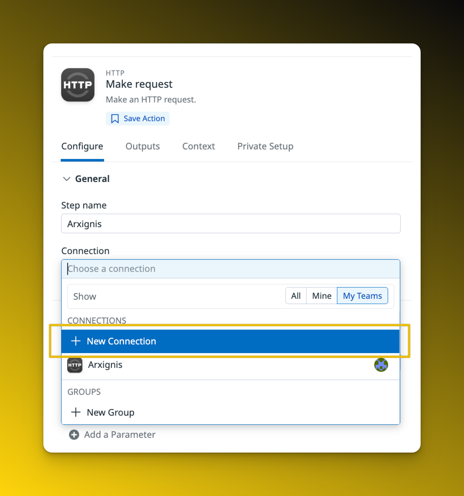
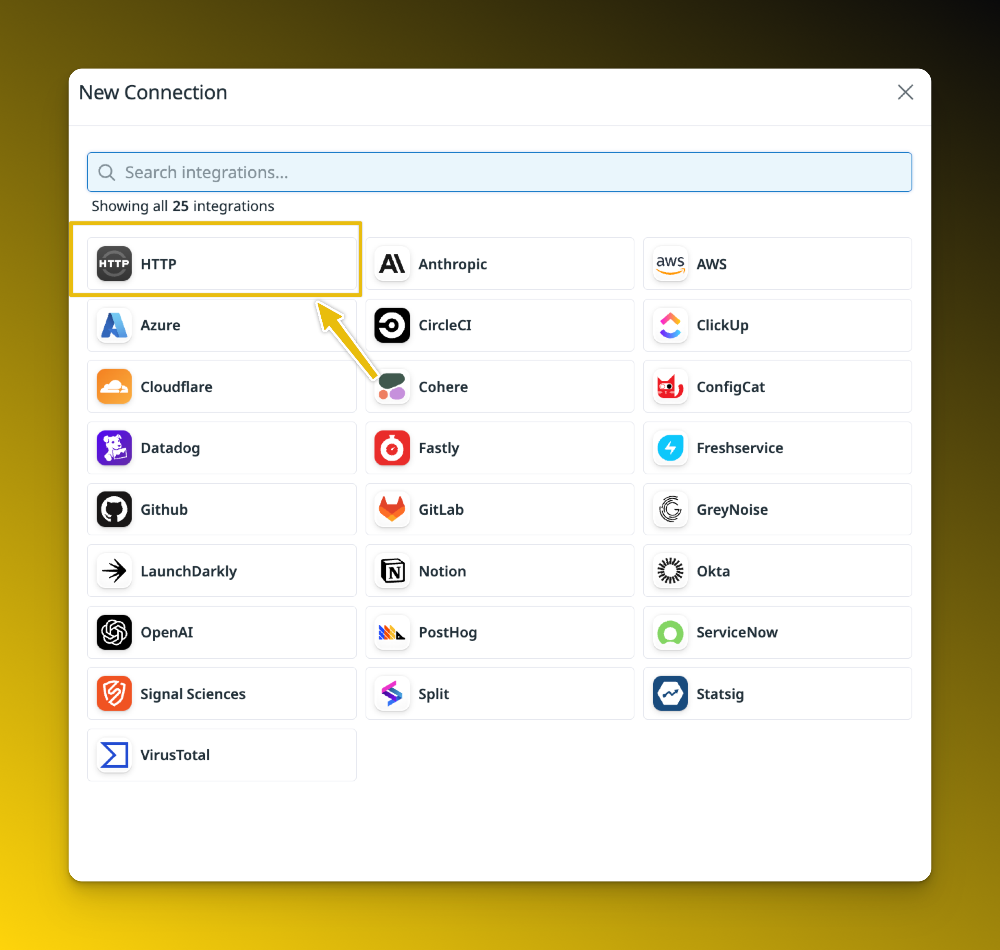
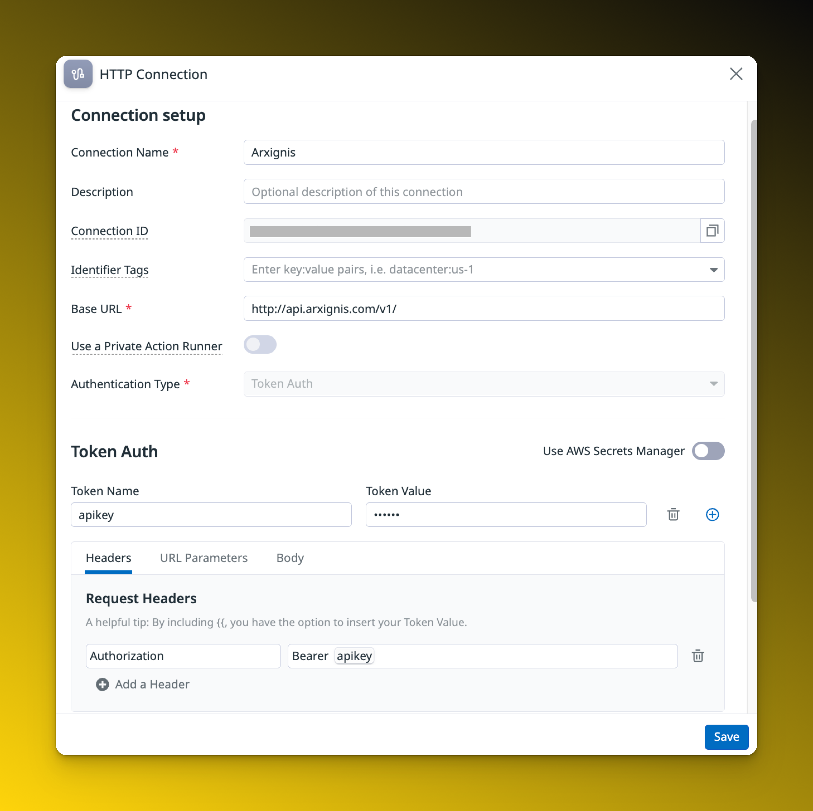

# Datadog Security Workflow

A Datadog workflow that automatically responds to security signals by extracting malicious IP addresses and services, creating an investigative notebook, and notifying security responders via Slack. Responders can then choose to either block the IPs directly in Arxignis or create a security incident for further investigation.

## Features

- Automatically triggers on Datadog security signals
- Extracts IP addresses and affected services from security signal data
- Creates an investigative notebook for security analysis
- Sends interactive Slack notifications with action options
- Supports direct IP blocking in Arxignis or incident creation
- Includes retry logic for API calls to Arxignis

## Configuration

Import `datadog.json` into your Datadog Workflows workspace. Configure the workflow inputs:
- **Investigative notebook**: ID of the Datadog notebook template to use
- **IP set name** and **IP set ID**: Optional IP set parameters

Update the Slack notification settings (channel, team ID, mention targets) before publishing.

## Tutorial

1. Go to your Datadog dashboard.
2. On right side click on the Actions -> New workflow.
3. 
4. [Download datadog json template](./datadog.json)
5. 

When you finished the import you can see this.

### Create new connection
You have to create a new connection.

1. Choose Arxignis step
2. Right side connection menu.
3. 
4. 
5. 
6. Add your arxignis API key to token value.
7. Use this connection in the workflow.

> ❗ Setup your Slack connection on our picture already configured.

# Congrats
Your system is most secure before this workflow.

